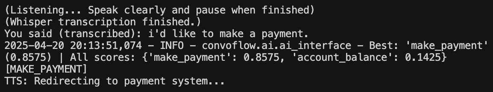
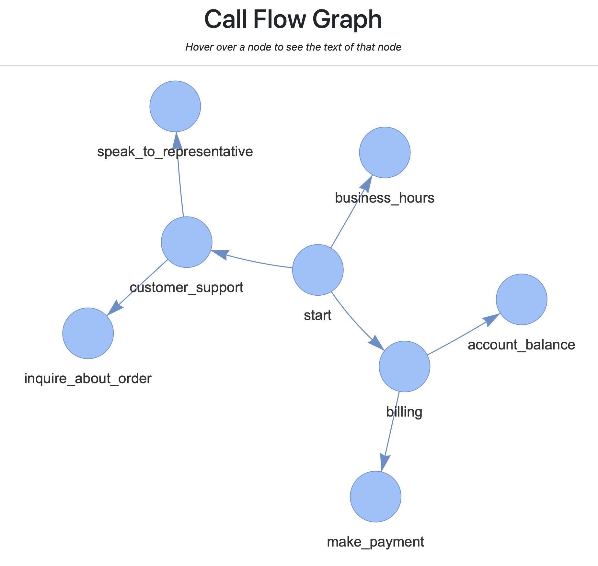

# ConvoFlow

**ConvoFlow** is a modular, AI-powered framework for building intelligent, conversational phone trees (IVR systems). It uses a graph-based design, supports voice interfaces and text interfaces, and integrates advanced models like Whisper and BART to enable natural and scalable conversational automation. ConvoFlow is designed for both rapid prototyping and production deployment.

---

## Features

- **Graph-based flow system**: Model your IVR routes using nodes and transitions.
- **Database-backed**: Uses PostgreSQL and Neo4j (via Docker) to manage session logs and graph structures.
- **Zero-shot classification**: Uses `facebook/bart-large-mnli` to understand and route user intent.
- **Voice input + output**:
  - Transcription via `openai/whisper-large-v3`
  - Text-to-speech via `microsoft/speecht5_tts` + vocoder `microsoft/speecht5_hifigan`
  - Speaker embeddings via `Matthijs/cmu-arctic-xvectors`
- **CLI dev mode**: Test call flows quickly with just text.
- **Speech-enabled runtime**: Interact with your call flows through your microphone and speakers.
- **Back navigation**: Say "go back" to return to the previous node.
- **Logging & analytics**: Logs user journeys and decisions through the graph into PostgreSQL.
- **Testable and modular**: Fully structured to support unit testing and scalable deployment.
- **Designed for parallelization**: Databases are split by type to enable multiple call sessions running concurrently on a server.

---

## Installation

### 1. Clone and Setup Environment

```bash
git clone https://github.com/EngineerAlexander/convoflow.git
cd convoflow
python3 -m venv venv
source venv/bin/activate
pip install .
```

> **Optional:** If using microphone/speaker features on macOS, install PortAudio system dependency:
```bash
brew install portaudio
```

### 2. Set Environment Variables

Ensure your `.env` file contains the correct credentials and matches the values in `docker-compose.yml`.

---

## Running the App

### 3. Spin Up Databases (PostgreSQL + Neo4j)

```bash
docker-compose up -d
```

- PostgreSQL will store session logs.
- Neo4j will manage the conversational graph.

To tear down the containers after running later:

```bash
docker-compose down -v
```

---

### 4. Run Configuration Scripts

You can inspect and build your graph or verify database connectivity using helper scripts in the `scripts/` directory:

```bash
scripts/
├── check_db_connections.py   # Verify Neo4j and PostgreSQL connections
├── initialize_db.py      # Initialize the Neo4j graph db with convoflow library
├── visualize_graph.py  # Generate HTML visualization of the Neo4j graph
```

---

### 5. Choose a Runtime Mode

Run one of the example scripts:

#### Text-Only (CLI):

```bash
python examples/dev_cli_example.py
```

#### Voice-Enabled Mode:

```bash
python examples/example.py
```

---

## Visuals

Here are some pictures from the use of ConvoFlow:

**Node During Voice Mode:**



**Visualization of Graph to Traverse Through:**



---

## Project Structure

```
convoflow/
├── ai/              # Model for zero-shot classification. Note LLM would have also worked
├── core/            # Runners for both modes of app
├── data/            # Graph abstraction
├── io/              # STT (speech-to-text) and TTS (text-to-speech)
├── db/              # PostgreSQL definitions for metrics logging
├── examples/        # CLI and voice runner scripts being used in-action
├── scripts/         # Helper scripts for graph and DBs
├── pyproject.toml   # Project dependencies and config
├── .env             # Environment variable definitions
```

---

## Models Used

- **Zero-shot classification**: `facebook/bart-large-mnli`
- **Speech-to-text**: `openai/whisper-large-v3`
- **Text-to-speech**: `microsoft/speecht5_tts`
- **Vocoder**: `microsoft/speecht5_hifigan`
- **Speaker Embeddings**: `Matthijs/cmu-arctic-xvectors`

---

## License

MIT License

---

## Author

Developed by Bijan Ardalan — an AI-first IVR framework for voice-driven applications and conversational automation.

ConvoFlow supports both **terminal-based interaction** and **real-time audio interfaces** for next-gen phone tree systems.